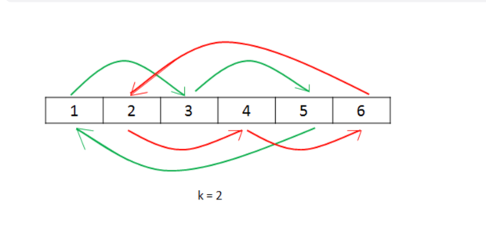

# Rotate array
https://leetcode.com/problems/rotate-array

## [1. Brute Force](des1)
**Time complexity**: O(n*k)

**Space complexity**: O(1)

## [2.Using Extra Array](des2)
**Time complexity**: O(2*n)

**Space complexity**: O(n)

## [3.Using Cyclic Replacements](des3)

**Time complexity**: O(n)

**Space complexity**: O(1)

## [4.Using Reverse](des4)
**Time complexity**: O(n)

**Space complexity**: O(1)