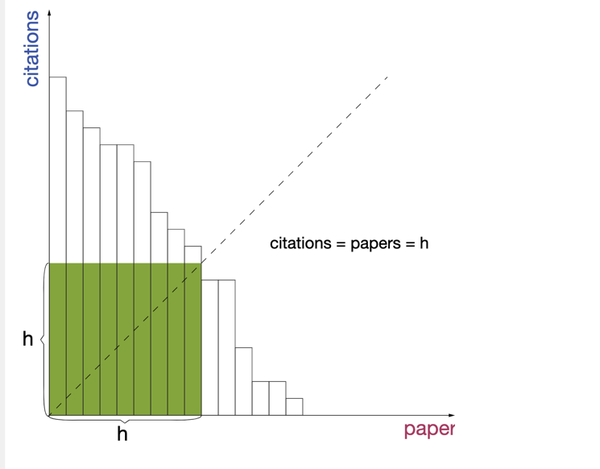
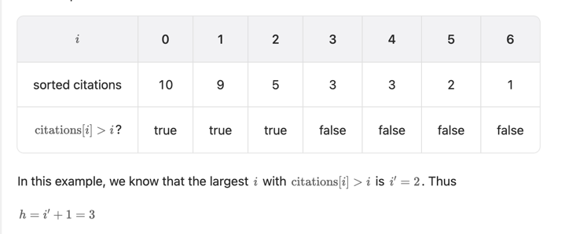
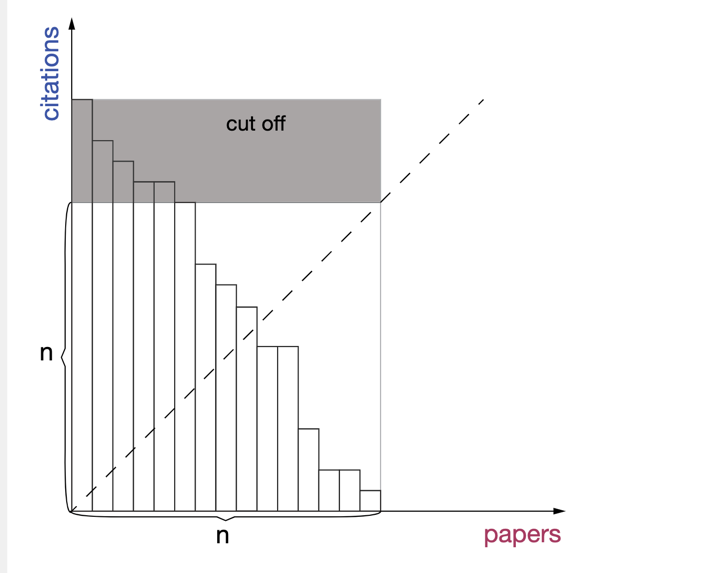

#  H-Index

https://leetcode.com/problems/h-index/

## [Sorting](des1)

**Time complexity**: O(n*log(n)) Sort the array

**Space complexity**: O(1)

##  [Counting](des2)

**Time complexity**: O(n)
**Space complexity**: O(n)