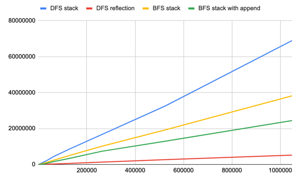
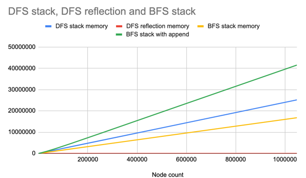

# Average of Levels in Binary Tree

https://leetcode.com/problems/average-of-levels-in-binary-tree/

## [1. DFS Stack](des1)
**Time complexity**: O(n)

**Space complexity**: O(1)

## [2.DFS reflection](des2)
**Time complexity**: O(n)

**Space complexity**: O(h) - levels count

## [3.BFS stack](des3)
**Time complexity**: O(n)

**Space complexity**: O(m) - m refers to the maximum mumber of nodes at any level in the input tree.

## Benchmarks
ns/op = nanoseconds per operation

B/op = bytes of allocations per operation

